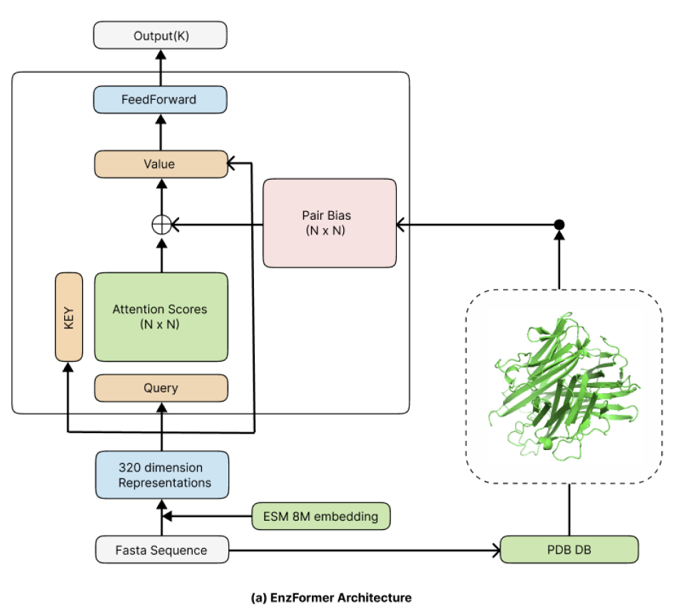
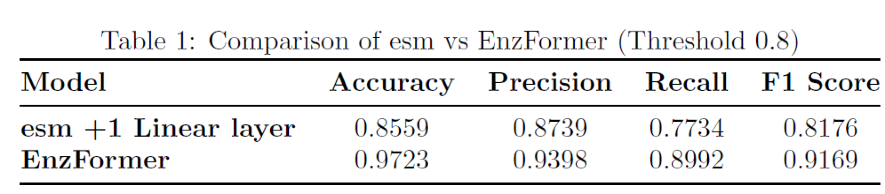
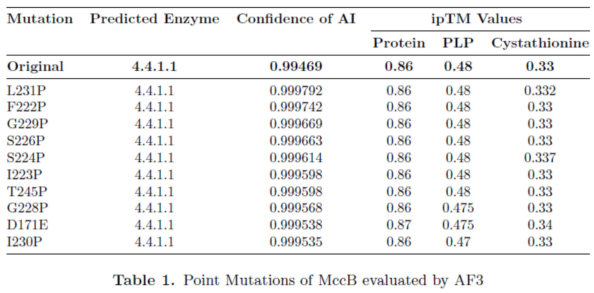

# EnzFormer
1. The model uses META's ESM as the embedding model and transformer architecture as the enzyme classifier 
2. The purpose of the model is to look at the FASTA file and classify the enzymes 
3. We have prepared the code to train it, so let's train it!
4. Beyond categorization, there is also the purpose of evaluating for point mutations


## How to use

### Create a virtual environment

```
cd EnzFormer
conda env create -f environment.yaml
pip install -e .
```

### fastafiles

There are data examples in data folder.

The data has the following conditions

1. fasta_dir must not contain subfolders 
2. only one sequence must exist in the fasta file 
3. the top line of the fasta file must contain the number (integer) of the corresponding group.


### Usage

#### Training
```
usage: train [-h] [--dropout_rate DROPOUT_RATE] [--weight_decay WEIGHT_DECAY]
             [--nogpu]
             model_location fasta_dir save_dir output_dim num_blocks
             batch_size learning_rate num_epochs
```

#### Evaluation
```
usage: evaluate [-h] [--nogpu]
                model_location fasta_path model_checkpoint output_dim
                num_blocks
```

### Performance for EC num 4.4.1.x

#### Fine tuning result

#### Point mutation result



