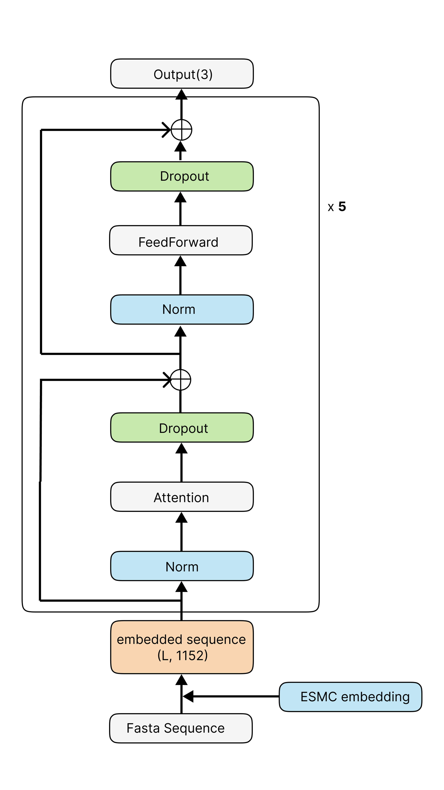
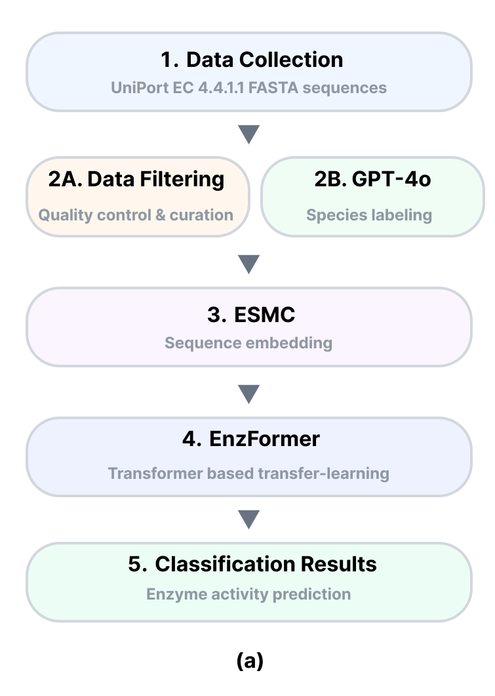
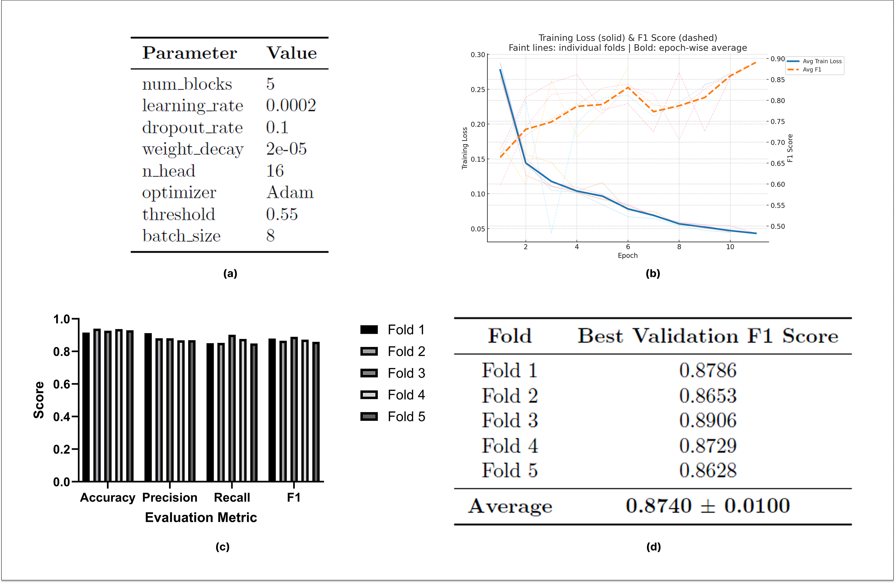

# EnzFormer: Enhancing Enzyme Activity via LLM-Guided Labeling and ESMC-Transformer Integration

EnzFormer is a deep learning pipeline for targeted enzyme optimization. This project presents an AI-driven framework that integrates data labeling using large language models (LLMs) with a Transformer-based deep learning model. The model is fine-tuned using protein sequence embeddings from Evolutionary Scale Modeling-Cambrian (ESM-C) to capture sequence-function relationships and guide the design of point mutations for enhanced enzymatic activity.

This repository contains the code for the paper: **"Enhancing MccB Enzyme Activity via LLM-Guided Labeling and ESMC-Transformer Integration for Targeted Point Mutation Design"**.


*Figure: The EnzFormer model architecture, which processes ESMC embeddings through a Transformer encoder to predict enzyme activity.*

## Abstract

Enzyme engineering presents significant potential for diverse industrial applications but remains hindered by the limitations inherent in random mutagenesis approaches, particularly for enzymes exhibiting evolutionary saturation, such as L-cystathionine γ-lyase (MccB). To address this challenge, we developed a novel artificial intelligence-driven pipeline designed for targeted enzyme optimization. Our approach integrates extensive data labeling facilitated by the contextual reasoning capabilities of GPT-4o with a Transformer-based deep learning model fine-tuned using protein sequence embeddings from Evolutionary Scale Modeling-Cambrian (ESM-C). This model effectively captures the nuanced sequence-function relationships specific to MccB, thereby enabling efficient in silico screening of extensive mutation libraries. Through this method, we successfully identified and experimentally validated the V129G variant, which demonstrated a statistically significant increase (~14%) in total enzymatic activity relative to the wild-type enzyme. Our findings underscore the viability and effectiveness of AI-assisted strategies for rational enzyme enhancement, offering substantial promise for broader applications in enzyme engineering.

## Citation

If you use this code or our findings in your research, please cite our paper:

> Ungyu Lee, and Nam-Chul Ha. (2025). "Enhancing MccB Enzyme Activity via LLM-Guided Labeling and ESMC-Transformer Integration for Targeted Point Mutation Design". *Journal Name*, vol(issue), pages.

## Workflow



The project workflow consists of three main stages:
1.  **AI-Assisted Data Labeling:** Protein sequences of Cystathionine γ-lyase (CGL, EC 4.4.1.1) were curated from UniProt. GPT-4o was used to classify sequences into 'high activity' or 'low activity' based on organismal and ecological context. A 'no-activity' class was generated by introducing mutations at catalytically essential residues.
2.  **AI-Based Classification Model:** The labeled sequences are embedded using the ESMC protein language model. These embeddings are used to train EnzFormer, a Transformer-based classification model, to predict enzyme activity levels.
3.  **In Silico Screening and Validation:** A comprehensive library of single-point mutations of the SaMccB protein is generated. The model predicts the activity of these mutants, and top candidates are selected for experimental validation.

## Performance

EnzFormer was benchmarked against several machine learning models and demonstrated superior performance, achieving an average F1-score of 0.874 in a 5-fold cross-validation. The training dynamics showed stable convergence, indicating that the GPT-4o labeled dataset is robust for training a generalizable model.


*Figure: Training loss and F1 score over epochs for the 5-fold cross-validation.*

The model successfully identified the **V129G** variant, which was experimentally validated to have a **~14% increase in total enzymatic activity** compared to the wild-type enzyme.

## How to Use

### 1. Setup and Installation

First, clone the repository and create the specified Conda environment.

```bash
git clone https://github.com/your-username/EnzFormer.git
cd EnzFormer
conda env create -f environment.yaml
conda activate training
pip install -e .
```

### 2. Data Preparation

The model trains on pre-computed ESMC embeddings.
1.  **Prepare FASTA files:** You need a directory with FASTA files for your protein sequences.
2.  **Generate Embeddings:** Use the `esmc_embedding.py` script to generate ESMC embeddings for your FASTA files. The paper uses `ESMC-600M-2024-12` weights. The output should be `.npy` files containing the embeddings.
3.  **Prepare Labels:** Create a corresponding `_header.txt` file for each sequence, containing the integer class label (e.g., 0 for 'High activity', 1 for 'Low activity', 2 for 'No Activity').

The processed data for each sample should consist of two files:
1.  `{base_name}.npy`: The ESMC sequence embedding.
2.  `{base_name}_header.txt`: A text file containing the integer class label.

### 3. Training

The `train_three_cgl.py` script is used to train the EnzFormer model. It performs k-fold cross-validation and saves the best model checkpoints. You can also use `train_three_cgl_onlyesm.py` to train a simpler baseline model without the transformer blocks.

**Training Usage (example):**
```bash
python src/train_three_cgl.py <model_name> <save_dir> --output_dim 3 --num_blocks 5 --batch_size 8 --learning_rate 1e-4 --num_epochs 50 --n_head 16 --optimizer AdamW --dropout_rate 0.1 --weight_decay 1e-5
```

**Arguments:**
- `model_name`: Name of the ESM model (e.g., "600M").
- `save_dir`: Directory to save model checkpoints and plots.
- `--output_dim`: Number of classification groups (3 in the paper).
- `--num_blocks`: Number of Transformer blocks (5 in the paper).
- `--batch_size`: Training batch size (8 in the paper).
- `--learning_rate`: The learning rate for the optimizer.
- `--num_epochs`: Number of training epochs.
- `--n_head`: Number of attention heads (16 in the paper).
- `--optimizer`: Choice of optimizer (`Adam` or `AdamW`).
- `--dropout_rate`: Dropout rate.
- `--weight_decay`: Weight decay for the optimizer.
- `--nogpu`: Flag to force CPU usage.

### 4. Evaluation

The `evaluate_3cgl.py` script is used to assess the performance of a trained model checkpoint on a set of FASTA files.

**Evaluation Usage (example):**
```bash
python src/evaluate_3cgl.py <model_name> <fasta_path> <model_checkpoint> --output_dim 3 --num_blocks 5
```
- `model_name`: Name of the ESM model.
- `fasta_path`: Path to the FASTA file or directory of FASTA files to evaluate.
- `model_checkpoint`: Path to the trained model checkpoint (`.pth` file).
- `--output_dim`: Must match the trained model.
- `--num_blocks`: Must match the trained model.
- `--nogpu`: Flag to force CPU usage.

## Scripts

Here is a brief overview of the key scripts in the `src` directory:

-   `esmc_embedding.py`: Generates protein embeddings from FASTA files using the ESM model.
-   `model_250416.py`: Defines the main EnzFormer model architecture (ECT).
-   `onlyesm_model.py`: Defines a simpler baseline model that uses ESM embeddings directly for classification without transformer blocks.
-   `train_three_cgl.py`: The main script for training the EnzFormer model with 5-fold cross-validation.
-   `train_three_cgl_onlyesm.py`: Script for training the baseline ESM-only model.
-   `evaluate_3cgl.py`: Evaluates a trained model on new data, providing predictions and confidence scores.
-   `evaluate_best_gradient_3cgl.py`: An evaluation script that also calculates integrated gradients for model interpretability.
-   `XGboost.py` / `randomforest.py`: Scripts for training and evaluating XGBoost and Random Forest models for comparison.
-   `uglee_umap.py`: Performs UMAP analysis for visualizing the embedding space.
-   `plot_deltapssm.py`: Calculates and plots the distribution of Delta PSSM scores.
-   `layers.py` / `transformer.py`: Contain definitions for various layers and the transformer block used in the main model.
-   `focal_loss.py`: Implementation of the focal loss function used during training.
-   `get_chainid.py`: A utility script to extract chain IDs from PDB files.
