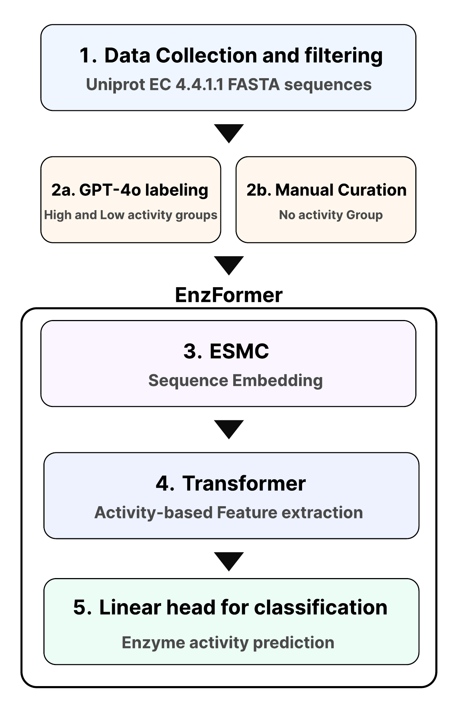
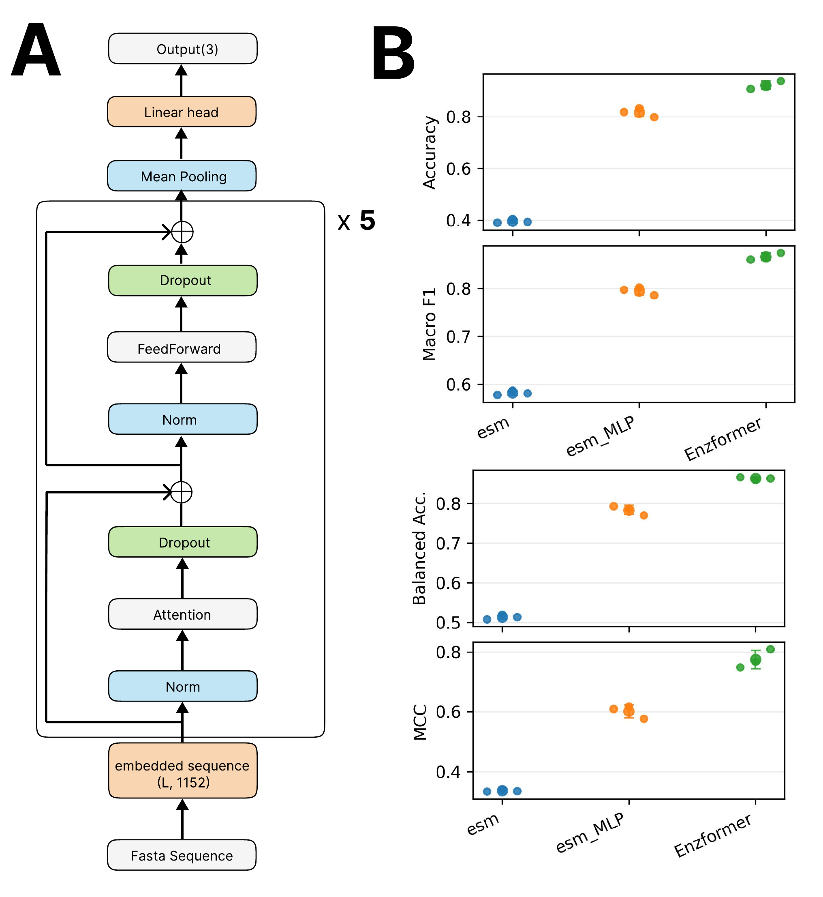
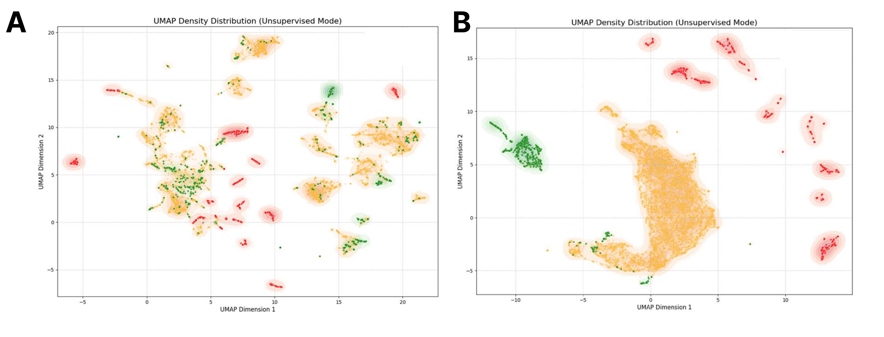

# Family-Specialized Transformer for L-cystathionine Gamma-lyase Engineering and Its Structural Interpretation

EnzFormer is a deep learning workflow for targeted enzyme engineering. The study combines GPT-4o-assisted labeling of CGL homologs with an ESMC embedding pipeline and a Transformer classifier to prioritize activity-enhancing point mutations.


*Figure: Workflow used in the manuscript, from sequence collection and labeling to EnzFormer training.*


*Figure: EnzFormer architecture built on ESMC sequence embeddings and Transformer blocks.*


*Figure: Representative performance summary from the manuscript figures.*

## Citation

If you use this code or the reported findings, please cite the paper:

> Ungyu Lee, Minho Park, and Nam-Chul Ha. (2025). "Family-Specialized Transformer for L-cystathionine Gamma-lyase Engineering and Its Structural Interpretation". *Journal Name*, vol(issue), pages.

## References

- [ESMC-600M-2024-12](https://huggingface.co/EvolutionaryScale/esmc-600m-2024-12)

## Project Overview

The manuscript workflow has three stages:

1. **Label construction:** natural CGL homologs are grouped into activity classes using GPT-4o-assisted organism-context labeling and manual curation.
2. **Model training:** EnzFormer learns from precomputed ESMC embeddings and class labels.
3. **Mutation screening:** the trained ensemble scores point mutations and reports probabilities together with interpretation features such as integrated gradients and delta-PSSM.

The public snapshot is focused on model training and inference. Large datasets, checkpoints, and reference scoring artifacts are not fully bundled in Git, so reproducibility depends on preparing the expected inputs and placing them where the scripts can read them.

## Script Guide

The key public scripts are:

- `src/esmc_embedding.py`: generate ESMC embeddings from FASTA input
- `src/train_three_cgl.py`: train the EnzFormer classifier with 5-fold cross-validation
- `src/train_three_cgl.sh`: shell wrapper for the manuscript training configuration
- `src/train_three_cgl_onlyesm.py`: baseline training without Transformer blocks
- `src/evaluate_3cgl.py`: ensemble inference on mutation candidates
- `src/evaluate_3cgl.sh`: shell wrapper for evaluation with multiple checkpoints
- `src/evaluate_best_gradient_3cgl.py`: gradient-based interpretation helper
- `src/model_250416.py`: EnzFormer architecture definition
- `src/focal_loss.py`: focal-loss implementation used during training


### 1. Installation

Clone the public repository and create the published Conda environment:

```bash
git clone https://github.com/iungyu-snu/EnzFormer.git
cd EnzFormer
conda env create -f environment.yaml
conda activate enzformer_mccb
pip install -e .
```

All commands below use direct script execution with `python src/...` so that the instructions match the public snapshot exactly.

### 2. Preprocessing And Input Layout

The public training and inference scripts work with precomputed ESMC embeddings. For each sample, prepare:

- `{basename}.fasta`
- `{basename}.npy`
- `{basename}_header.txt`

The header file should contain a single integer class label:

- `0` = GOOD / high activity
- `1` = BAD / low activity
- `2` = No enzyme

Use `src/esmc_embedding.py` to generate an embedding from one FASTA file:

```bash
python src/esmc_embedding.py path/to/sample.fasta
```

Important preprocessing details for the public snapshot:

- The script reads the first sequence in the FASTA file.
- The output is saved as `{basename}.npy` in the current working directory.
- The training scripts expect `.npy` and `_header.txt` pairs with matching basenames.
- The inference script expects each `.fasta` file to have a matching `.npy` file in the same directory.

A typical prepared sample layout is:

```text
prepared_dataset/
  sample_001.fasta
  sample_001.npy
  sample_001_header.txt
  sample_002.fasta
  sample_002.npy
  sample_002_header.txt
```

### 3. Training

The main manuscript model is trained with `src/train_three_cgl.py`. The public `src/train_three_cgl.sh` script uses the following manuscript configuration:

- model: `600M`
- output classes: `3`
- Transformer blocks: `5`
- batch size: `16`
- learning rate: `0.0002`
- epochs: `50`
- attention heads: `16`
- threshold: `0.55`
- optimizer: `Adam`
- dropout: `0.1`
- weight decay: `2e-05`

Equivalent direct command:

```bash
python src/train_three_cgl.py \
  600M \
  results/original_model \
  3 \
  5 \
  16 \
  0.0002 \
  50 \
  16 \
  0.55 \
  Adam \
  --dropout_rate 0.1 \
  --weight_decay 2e-05
```

Typical output files include:

- `*_fold1_best_f1_epoch*.pth`
- `*_fold1_best_f1_epoch*_metrics.json`
- `*_fold1_best_f1_epoch*_confusion_matrix.png`
- `*_fold1_best_f1_epoch*_reliability_multiclass.png`
- `*_fold1_best_f1_epoch*_reliability_high_class.png`
- `*_cv5_summary.csv`


`src/train_three_cgl_onlyesm.py`: for an ESM-only baseline without Transformer blocks.

### 4. Inference

Use `src/evaluate_3cgl.py` for ensemble inference. 
```bash
python src/evaluate_3cgl.py \
  600M \
  path/to/fasta_dir \
  path/to/fold1_best.pth \
  path/to/fold2_best.pth \
  path/to/fold3_best.pth \
  path/to/fold4_best.pth \
  path/to/fold5_best.pth \
  3 \
  5 \
  --n_head 16 \
  --dropout_rate 0.1 \
  --reference_pssm_npy path/to/MccB_pssm2.npy
```

Inference requirements:

- `path/to/fasta_dir` must contain `.fasta` files.
- Each FASTA must have a matching `{basename}.npy` file in the same directory.
- All ensemble checkpoints must be provided before `output_dim` and `num_blocks`.
- `--reference_pssm_npy` is required for delta-PSSM scoring.

The inference output reports:

- predicted class label
- confidence
- probability for each class
- Delta-PSSM
- Delta-BLOSUM62
- custom ranking score
- top integrated-gradient residues
- top attention-weight residues


### 5. Dataset Availability

The dataset used in this study is available on Zenodo:

https://doi.org/10.5281/zenodo.17291636
